Astro build of Cédric Bontems' personal websitebuilt using Astro as the SSG, Open Props for design tokens, hosted on NEtlify with automatic deployment form Github.

## Lighthouse Score

  <a href="https://pagespeed.web.dev/analysis/https-cedricbontems-fr/71cpfg78ac?form_factor=desktop">
    
  <a>

---

## Local Setup
Running local set up will install all necessary bundles and dependencies.
    
    $ cd cedricbontems.fr
    $ npm install

---

## Development
Running development will run a local server watching for changes and reloading accordingly.

	$ cd cedricbontems.fr
	$ npm run dev

---

## Building
Building will convert all assets into a static site, resulting with the entire site ready in the dist directory for deployment.

    $ cd cedricbontems.fr
    $ npm run build

---

## Previewing
To test the static site prior to deployment, the site must be built and then served in its static form so you can run it locally

    $ cd cedricbontems.fr
    $ npm run build
    $ npm run preview

---

## Commiting
This repo uses commitizen to help keep things organized with conventional comits.

    $ cd cedricbontems.fr
    $ npm run commit

---

## Releasing
This repo uses commitizen to handle releases. It handles versioning following semantic version rules based on commits.

    $ cd cedricbontems.fr
    $ npm run release

---

## Deploying
A deploy is automatically triggered on Nelify when changes are pushed to the github repository. The deploy status is visible on the badge here and at the top of this file.

    $ cd cedricbontems.fr
    $ git push

---

## Updating
Updating will check all packages for updates, allow you to select which ones should be updated, update the corresponding package files with the new version, and download and install the selected updates.

    $ cd cedricbontems.fr
    $ npm run update
